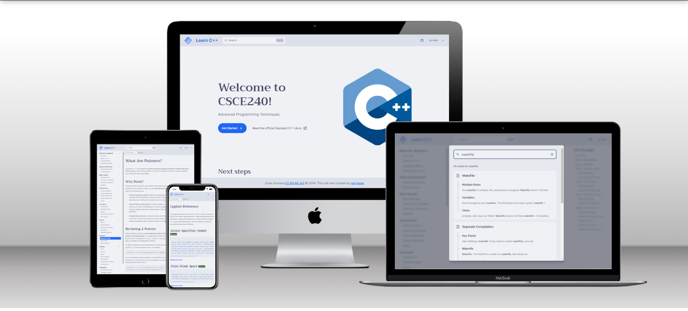

# CSCE240 Website

A Technical Documentation Website that teaches the C++ concepts learned in CSCE240 Advanced Programming Techniques at the University of South Carolina.

[](https://starlight.astro.build)

```
npm create astro@latest -- --template starlight
```



## Details

- [Astro](https://astro.build/) - web framework

- [Catppuccin](https://github.com/TheOtterlord/catppuccin-starlight) - color theme plugin

    - Project wouldn't build using `catppuccin()`
    - Easy fix is to copy and paste the CSS files into a `styles` folder in the `src` folder
    - Update `astro.config.mjs` using the `customCss` key:
```js
    export default defineConfig({
        integrations: [
            starlight({
                customCss: [
                    // Import shared, a light theme, and a dark theme
                    "./src/styles/shared.css",
                    "./src/styles/catppuccin-latte-blue.css",
                    "./src/styles/catppuccin-mocha-blue.css",
                ],
            })
        ]
    })
```
- Fonts through [Fontsource](https://fontsource.org/):
    - [Inter](https://fontsource.org/fonts/inter) - base font
    - [Fira Code](https://fontsource.org/fonts/fira-code) - code font
    - [Trirong](https://fontsource.org/fonts/trirong) - heading font

- [Excalidraw](https://excalidraw.com/) - drawing tool

- [Favicon.io](https://favicon.io/) - favicon generator

- [Inkscape](https://inkscape.org/) - graphic design

- [Starlight](https://starlight.astro.build/) - astro technical documentation template

- [TechSini](https://techsini.com/) - website mockup

- [TinyPNG](https://tinypng.com/) - image compression
